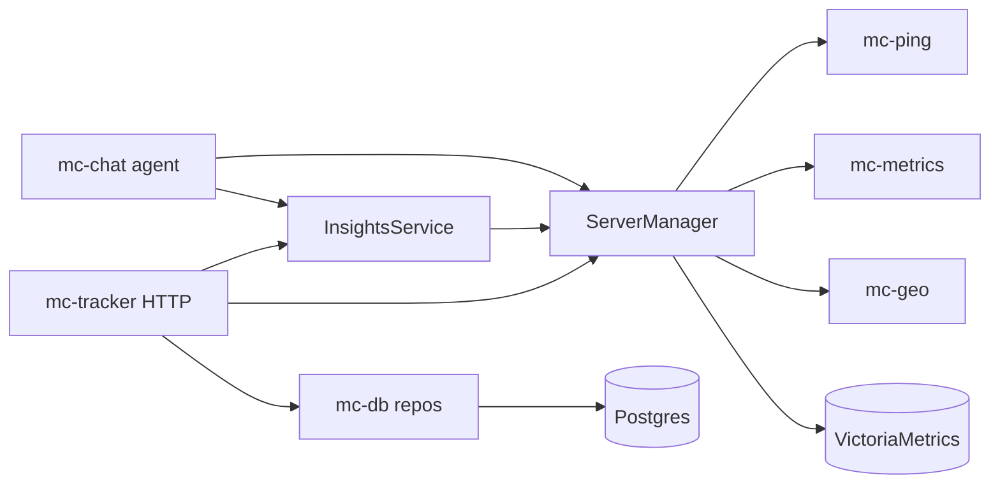

# mc-tracker Codebase Audit

**Date:** 2026-07-03  
**Scope:** Rust workspace (`crates/`, `tests/integration/`), high-level `www/` API usage  
**Method:** Full read of all crates, grep for unwrap/unsafe/dead code, clippy pass, integration test inventory

---

## Executive summary

The workspace is **architecturally sound for an early-stage monorepo**: thin Diesel repos, DTOs in `mc-api-types`, protocol isolation in `mc-ping`/`mc-dns`/`mc-geo`, VM logic in `mc-metrics`, and clear trait seams for chat/insights. **Clippy passes** with only minor style warnings in `mc-chat`.

The dominant technical debt is **concentration in `mc-tracker/src/manager.rs` (~1,830 lines)** — ping orchestration, VM I/O, search, and all public read-model DTO assembly in one file. Secondary risks are **admin DB/memory dual-write without transactions**, **production panics in the chat SSE path**, **session revocation stored in an unbounded in-memory set**, and **read-path performance** (full server clones + VM fan-out on every list request).

| Severity | Count (approx.) | Theme |
|----------|-----------------|-------|
| High | 5 | God object, dual-write consistency, chat panics/quota, session revocation, list-path VM fan-out |
| Medium | 12 | Boundary leaks in `mc-db`, DNS re-export, duplicated validation, reqwest client per instance |
| Low | 20+ | Constants, naming, test harness duplication, minor clippy |

See [`docs/cleanup.md`](cleanup.md) for the refactor execution plan.

---

## Architecture assessment

### What's working



- **No raw SQL in HTTP handlers** — repos only.
- **Auth middleware re-loads user from DB** on each request (`auth/middleware.rs`) — role demotion and flag changes take effect without re-login.
- **Admin routes** gated by `require_admin` (`api.rs`).
- **Session cookies**: HttpOnly, SameSite=Strict, Secure outside development (`auth/session.rs`).
- **Strong unit tests** for manager search/sort/ASN, ping protocol parsing, PromQL builders, metric alignment.
- **Integration tests** with real Postgres + wiremock VM for metrics, insights, chat quota.

### Boundary violations (fix priority)

| Issue | Location | Recommendation |
|-------|----------|----------------|
| CORS origin logic on DB model | `mc-db/model/settings.rs:112-137` | Move to `mc-tracker` (HTTP/deployment) |
| VM import URL construction | `mc-db/model/settings.rs:40-44` | Move to `mc-metrics` or tracker config |
| `chat_quota_exempt` policy | `mc-db/model/user_flags.rs:23` | Move to `mc-tracker/chat` |
| `mc-ping` re-exports all of `mc-dns` | `mc-ping/lib.rs:11-14` | Tracker imports `mc-dns` directly |
| DTO mappers in manager | `manager.rs:1241-1266` | `admin/mappers.rs` or `settings.rs` |
| `TimeseriesLanes::insert_lane` behavior on DTO | `mc-api-types/response/timeseries.rs` | Acceptable for now; document as builder helper |
| `mc-insights` depends on full `mc-metrics` for `min_span`/`max_span` | `mc-insights/range.rs` | Extract span bounds to `mc-common` |

### God object: `ServerManager`

`manager.rs` mixes:

| Concern | Lines (approx.) |
|---------|-----------------|
| `TrackedServer` state + peak tracking | 62-117 |
| Search / ASN aggregation | 127-197 |
| Public read responses (servers, ASNs, search) | 338-666 |
| Timeseries assembly | 699-800 |
| VM query helpers | 802-1129 |
| Push cycle + ping | 827-945, 981-1035 |
| Cron scheduler | 1280-1341 |
| DTO mappers (`settings_response`, etc.) | 1155-1266 |
| Unit tests | 1373-1828 |

**Impact:** Any API field change touches the hot orchestration file; hard to test ping/VM paths in isolation.

---

## Security

### High / medium

| Finding | Location | Risk |
|---------|----------|------|
| Session revocation set never pruned, lost on restart | `auth/session.rs:30, 86-88` | Revoked tokens valid after restart; memory growth |
| `SESSION_SECRET` not validated for length/entropy | `main.rs:58-59` | Weak secrets accepted |
| Bootstrap admin allows empty username/password via `unwrap_or_default` | `main.rs:107-108` | Empty admin if env unset when users table empty |
| `CF-Connecting-IP` trusted for login rate limit | `auth/rate_limit.rs:15-21` | Spoofable if not behind Cloudflare; non-CF clients share `127.0.0.1` bucket |
| Chat rate limit keyed on connection IP, not user | `chat.rs:66` | NAT/shared IP; bypass via IP rotation |
| Chat quota charged before stream succeeds | `chat.rs:88-94` | Failed LLM calls consume weekly quota |
| Password change returns `err.to_string()` to client | `auth/handlers.rs:182-186` | May leak DB/internal errors |
| Signup allowed in `development` regardless of `sign_up_enabled` | `auth/handlers.rs:222-224` | Intentional dev ergonomics — document clearly |

### Low / acceptable

- Login maps DB errors to generic `invalid_credentials` — good for enumeration resistance.
- `verify_password` uses `unwrap_or(false)` — failed verify looks like bad password.
- No password strength policy beyond non-empty.
- No `unsafe` in workspace.
- Public dashboard routes correctly use `credentials: "omit"` in `www/` API client.

### Auth positives

- HMAC-signed cookies; no API tokens in browser.
- Admin RBAC tested (`tests/rbac_and_cors.rs`) including demoted admin and `UNLIMITED_CHAT` flag.
- New admin user/flags API (`admin.rs:30-31`) reads/writes DB only — flags affect chat quota correctly.

---

## Correctness & consistency

### Admin dual-write (DB + in-memory)

`admin.rs` pattern for servers:

1. `servers::insert/update/delete` (Postgres)
2. `manager.append_server/update_server_config/remove_server` (memory)

**No transaction.** If step 2 fails after step 1 succeeds (`admin.rs:119-124` on update), DB and memory diverge.

**Inconsistent read sources:**

- `GET /admin/servers` → in-memory manager (`admin.rs:34-35`)
- `GET /admin/servers/{id}` → Postgres (`admin.rs:73-77`)

After ping cycles, admin GET may lack live fields present in list from memory (or vice versa if sync failed).

### Duplicate error mapping

| Error | `api.rs:299-307` | `insights.rs:317-322` |
|-------|------------------|----------------------|
| `MetricsError::InvalidWindow` | 400 | Mapped via `InsightsError::InvalidRange` |
| Other `MetricsError` | **500 + `err.to_string()`** | Wrapped as `InvalidRange` string |

VM internal errors may surface on timeseries endpoints but not insights summaries.

### Time-range validation (two systems)

- **Epoch windows:** `mc-metrics::MetricQueryWindow` (`query_window.rs`)
- **Human ranges:** `mc-insights::DefaultTimeRangeParser` (`range.rs`) — `7d`, `now`, `%Y-%m-%d`

Both enforce min/max span with separate messages. Clock source differs: insights `parse_range` uses `SystemTime` (`insights.rs:228-231`) vs metrics window normalization.

### Product rule: 3-day daily-avg threshold

`mc-insights/analyze.rs:7-18` picks `PLAYERS_DAILY_AVG` lane when `span_seconds >= 3 * 86_400`. Manager always fetches **both** lanes for server timeseries (`manager.rs:750-770`). Threshold is undocumented at API level.

### Chat quota calendar

`WEEKLY_MESSAGE_LIMIT` (`chat_quota.rs:7`) uses Monday-start calendar week (`calendar_week_start_utc`). Name says "weekly" — behavior is calendar-week, not rolling 7-day.

---

## Performance

### Hot paths (dashboard list)

| Pattern | Location | Impact |
|---------|----------|--------|
| `self.servers.read().await.clone()` | `manager.rs:345, 385, 531-532, 594` | Full copy of all tracked servers per request |
| 3 parallel VM queries per list | `manager.rs:354-358`, `555-559` | `peak_players_24h`, `peak_players_7d`, `peaks_24h_by_server_id` on every `/servers` and `/asns` |
| `get_tracked` clones per ping | `manager.rs:986-990` | N clones per push cycle |
| Per-result `write()` lock in push | `manager.rs:875-914` | O(N) lock acquisitions per cycle |
| Unbounded `join_all` for pings | `manager.rs:856-860` | No concurrency cap for large fleets |
| Insights rank (chat tools) | `insights.rs:131-135` | O(servers) × VM queries per rank call |
| `std::sync::Mutex` in `ChatRateLimiter` | `chat.rs:31-48` | Blocks async executor |
| `reqwest::Client::new()` per metrics/chat client | `mc-metrics/client.rs:57`, `push/client.rs:12`, `mc-chat/llm/openai_client.rs:47` | Connection pool not reused across instances |

### VM degradation behavior

`query_scalar_promql` / `query_labeled_instant` log warnings and return `None`/`Vec::new()` (`manager.rs:1088-1128`). List endpoints **silently omit peak data** when VM is down — acceptable for UX but untested.

---

## Error handling

### Production `unwrap` / `expect` (non-test)

| File | Line | Notes |
|------|------|-------|
| `chat.rs` | 41 | `Mutex::lock().unwrap()` in async handler |
| `chat.rs` | 108, 113 | `Event::json_data(...).unwrap()` — serde failure panics |
| `chat_quota.rs` | 13 | `and_hms_opt(0,0,0).unwrap()` — safe invariant |
| `manager.rs` | 1366 | Cron `expect` after validation |
| `mc-dns/resolver.rs` | 30 | `build_public_resolver().expect(...)` — startup panic |
| `main.rs` | 161, 214, 220 | Bind address / signal handler |

All other `unwrap`/`expect` occurrences are in `#[cfg(test)]`, `build.rs`, or test helpers.

### Error type consistency

| Layer | Pattern |
|-------|---------|
| Library crates | `thiserror` enums — good |
| `mc-tracker` handlers | Map to `ErrorResponse` + status — good |
| `manager::ip_lookup_response` | `Result<_, String>` — stringly |
| `setup_database` / `create_pool` | `anyhow::Error` vs `DbError` in repos — mixed |

---

## Duplication inventory

### High-value dedup targets

| Pattern | Occurrences |
|---------|-------------|
| `ServerSummary` accumulation loop | `manager.rs:323-333`, `394-405`, `607-618` |
| Players-online sort key | 5× in `manager.rs` |
| Insights rank methods | `insights.rs:108-169` vs `171-225` |
| Insights summary handler error block | `api.rs:248-252`, `266-269`, `288-291` |
| `map_metrics_error` | `api.rs` vs `insights.rs` (different behavior) |
| `fixture_geo()` | `manager.rs` tests, `admin.rs` tests, `mc-test-support` |
| Test app bootstrap | 7+ copies in `tests/auth.rs` alone |
| `query_tokens` == `value_tokens` | `mc-search/lib.rs:24-35` |
| Bearer auth header | `mc-metrics/client.rs`, `push/client.rs` |
| `86_400` day constant | `mc-insights`, `mc-metrics` (4+ files) |
| `LIST_LIMIT` / `25` | `manager.rs:199`, `insights.rs:116,178`, `mc-chat/tools_impl.rs:17` |
| `sample_server()` | `tests/integration/metrics_api.rs`, `insights_api.rs` |
| Settings defaults | `AppSettings::default`, migration SQL, test maps |
| Unique violation check | `users.rs:147-157` inline vs `servers.rs:216-221` helper |

### Dead / pointless code

| Item | Location |
|------|----------|
| `DbContext` assigned to `_db` | `main.rs:113` |
| `parse_platform` wrapper | `admin.rs:210-212` |
| `compare_change_pct` no-op | `insights.rs:299-304` |
| `value_tokens` alias | `mc-search/lib.rs:33-35` |

---

## Crate summaries

### `mc-tracker` — **needs refactor**

See Executive summary. Additional notes:

- `insights.rs` (329 lines): no unit tests; rank methods expensive.
- `api.rs` (307 lines): no handler unit tests; CORS untested.
- `chat.rs` (134 lines): quota-before-stream; no unit tests.
- `settings.rs`: only merge test; `validate_settings` mostly untested.
- `tracker_read.rs`: thin trait delegations — fine.

### `mc-db` — **good repos, leaky model**

- Repos are thin and correct.
- `chat_messages` repo untested.
- `users::list`, `update_flags`, `update_role` lack integration tests.
- `servers::update_peak_if_higher` untested.
- `DbContext` unused.
- Settings key string literals scattered in `repos/settings.rs`.

### `mc-api-types` — **good**

- Missing serde round-trip tests for: users, insights, chat, asns.
- `PatchUserFlagsRequest.flags: i64` — no validation at type level.
- `AdminUser.created_at: String` — formatting forced in handler.

### `mc-metrics` — **good**

- Strong unit test coverage for PromQL, alignment, step policy.
- Rename `client.rs` (query) vs `push/client.rs` to reduce confusion.
- Inject shared `reqwest::Client`.

### `mc-ping` + `mc-dns` — **good protocols**

- `mc-dns::DnsResolver` trait + test mocks — exemplar pattern.
- `HickoryDnsResolver` only tested with `#[ignore]` live DNS.
- `DnsCache` uses `std::sync::Mutex` in async paths.
- SRV lookup swallows errors as `Ok(None)` (`resolver.rs:82`).

### `mc-geo` — **good**

- Background cron refresh in library crate — acceptable for this app.
- `LookupCache` uses `std::sync::Mutex` in async `lookup_asn`.

### `mc-insights` — **good, small**

- Trait seams (`TimeRangeParser`, `TimeseriesAnalyzer`) well used.
- Gaps: `"this month"` range, 3-day lane selection, trend ±5.0 edges.

### `mc-chat` — **good seams, large files**

- `agent.rs` (~767 lines), `tools_impl.rs` (~715 lines) need splitting.
- OpenRouter detection via `base_url.contains("openrouter.ai")` — fragile.
- 14 `ChatTool` implementations — trait pattern working.

### `mc-search` — **excellent**

- Zero dependencies.
- `combined` concatenation without separator (`lib.rs:107`) can cause false-positive cross-field matches.

### `mc-common` — **underbuilt**

- Only time helpers; should own shared constants (see `cleanup.md`).

### `mc-test-support` — **functional, heavy**

- Depends on full `mc-tracker` — compile coupling for all integration tests.
- Missing helpers for admin flags setup (partially covered in `rbac_and_cors.rs`).

---

## Test coverage matrix

| Area | Unit | Crate integration | Workspace integration |
|------|------|-------------------|----------------------|
| Manager search/sort/ASN | ✅ `manager.rs` tests | — | — |
| Ping protocols | ✅ `mc-ping` | — | — |
| PromQL / alignment | ✅ `mc-metrics` | — | — |
| Auth login/session | — | ✅ `tests/auth.rs` | ✅ `auth_api.rs` |
| RBAC / CORS / flags | — | ✅ `rbac_and_cors.rs` | partial |
| Admin servers/settings | — | ✅ `admin_*.rs` | — |
| Admin users/flags | — | ✅ `rbac_and_cors.rs` | ❌ |
| Metrics/timeseries HTTP | — | — | ✅ `metrics_api.rs` |
| Insights summary HTTP | — | — | ✅ `insights_api.rs` (minimal) |
| Chat SSE/quota/flags | — | — | ✅ `chat_api.rs` |
| ASN HTTP endpoints | — | — | ❌ |
| IP lookup HTTP | — | — | ❌ |
| Push cycle / live ping | ❌ | ❌ | ❌ |
| `insights` rank | ❌ | ❌ | ❌ |
| `chat` per-minute rate limit | ❌ | ❌ | ❌ |
| Quota on failed stream | ❌ | ❌ | ❌ |
| `mc-db` chat_messages | ❌ | ❌ | — |
| DTO serde (all types) | partial | — | — |

---

## Naming inconsistencies

| Concept | Variants |
|---------|----------|
| Platform | DB `platform`, API `server_type`, JSON `"PC"`/`"PE"` |
| Environment | `ENVIRONMENT` env, `metrics_environment` field, VM label `environment` |
| Summary types | `ServerSummary` (internal) vs `ServersSummaryResponse` (API) |
| Detail | `server_detail_response`, `get_server`, `TrackerRead::server_detail` |
| Signup | route `/auth/signup`, setting `sign_up_enabled`, handler `signup` |
| List cap | `LIST_LIMIT`, hardcoded `25`, `LIST_CAP` |

---

## `www/` (high-level)

Not deeply audited. Confirmed:

- Session cookie auth uses `credentials: "include"` for authenticated routes.
- Public dashboard uses `credentials: "omit"` — correct for anonymous reads.
- Chat uses SSE with credentials.

No Rust changes required for this audit pass.

---

## Clippy / tooling

```
cargo clippy --workspace -- -W clippy::all
```

**Result:** Clean except 2 warnings in `mc-chat`:

- `derivable_impls` on `LlmRequestOptions`
- `unnecessary_sort_by` in `tools/compact.rs:150`

No `unsafe`, no `todo!`/`unimplemented!`, no `#[allow(dead_code)]` in production code.

---

## Prioritized recommendations

### P0 — Correctness / security

1. **Admin server sync:** Single `AdminService` method that updates DB + memory atomically (or transaction + reload).
2. **Chat quota:** Record message only after successful stream completion (or on first token).
3. **Session revocation:** Persist revocations or use short-lived tokens + version counter in DB.
4. **Validate `SESSION_SECRET`** minimum length at startup.
5. **Bootstrap admin:** Reject empty username/password explicitly.

### P1 — Maintainability

1. Split `manager.rs` into `manager/` module tree (see `cleanup.md`).
2. Move CORS/VM URL/chat policy out of `mc-db`.
3. Stop re-exporting `mc-dns` from `mc-ping`.
4. Consolidate constants in `mc-common`.
5. Shared `reqwest::Client` for metrics + LLM clients.

### P2 — Performance (when fleet grows)

1. Avoid full `Vec<TrackedServer>` clone on reads — filter under read lock or maintain indexes.
2. Cache VM peak queries with TTL aligned to push cron.
3. Semaphore on parallel pings.
4. Batch write-lock updates in push cycle.

### P3 — Tests & polish

1. Integration tests for ASN routes, IP lookup, admin users API.
2. Consolidate test harness (`test_app()` in `mc-test-support`).
3. DTO serde tests for users, chat, insights, asns.
4. Unit tests for `insights` rank + `validate_settings`.

---

## Related documents

- [`docs/cleanup.md`](cleanup.md) — refactor plan and phased execution
- [`.cursor/rules/api-conventions.mdc`](../.cursor/rules/api-conventions.mdc) — intended layering
- [`.cursor/rules/rust-standards.mdc`](../.cursor/rules/rust-standards.mdc) — style and error patterns
